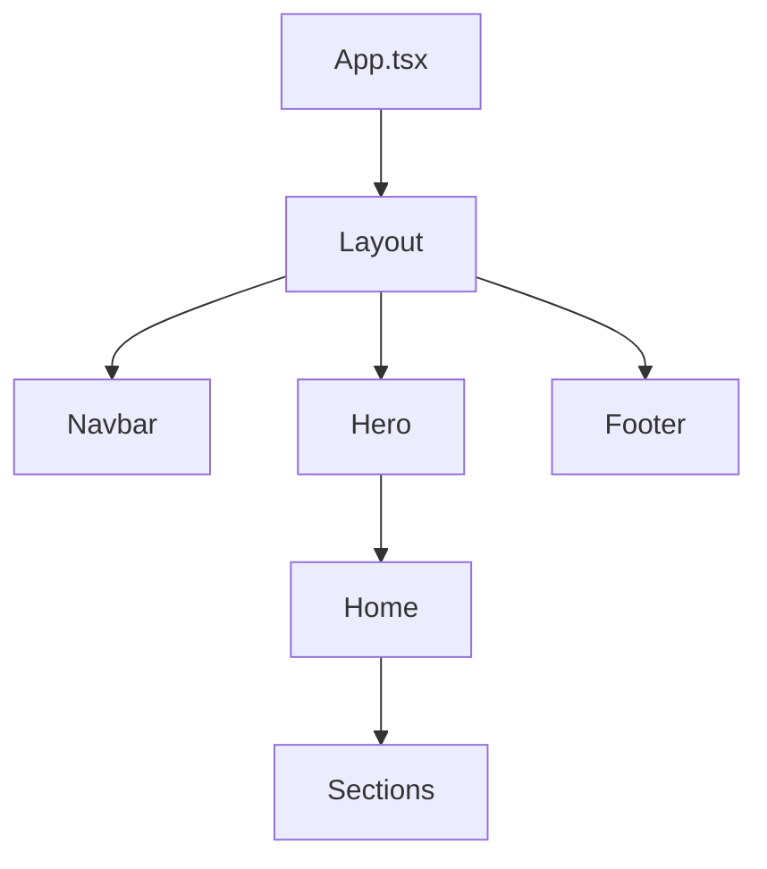

# MyHairCare Update Plan

## Current File Structure Analysis

### Core Files
```
src/
├── App.tsx              - Main application component
├── main.tsx            - Application entry point
├── index.css           - Global styles
├── i18n.ts             - i18n configuration
└── env.d.ts            - Environment type definitions
```

### Components Directory Structure
```
src/components/
├── layout/             - Layout components
│   ├── Layout.tsx      - Main layout wrapper
│   ├── Navbar.tsx      - Navigation bar
│   └── Footer.tsx      - Footer component
├── sections/           - Page sections
│   ├── Hero.tsx        - Hero section
│   ├── Procedures.tsx  - Procedures grid
│   ├── Results.tsx     - Results showcase
│   ├── Testimonials.tsx- Testimonials section
│   ├── Awards.tsx      - Awards showcase
│   └── Contact.tsx     - Contact form
└── ui/                 - Reusable UI components
```

### Pages Directory Structure
```
src/pages/
├── home/
│   └── index.tsx       - Home page
├── about/
│   └── index.tsx       - About page
├── procedures/
│   ├── index.tsx       - Procedures listing
│   ├── sapphire-fue.tsx- Sapphire FUE page
│   ├── dhi.tsx         - DHI technique page
│   └── stem-cell.tsx   - Stem cell therapy page
├── patient/
│   ├── index.tsx       - Patient info
│   └── testimonials.tsx- Testimonials page
└── test.tsx            - Translation test page
```

## Update Plan

### 1. Core Updates

#### App.tsx
- [x] Update routing structure
- [x] Implement TranslationProvider
- [ ] Add error boundaries
- [ ] Implement lazy loading

#### Layout.tsx
- [x] Add conditional Hero section
- [x] Fix header positioning
- [ ] Add mobile menu trigger
- [ ] Implement smooth transitions

### 2. Component Updates

#### Navbar.tsx
```typescript
// Required updates:
- Fix mobile responsiveness
- Add language switcher
- Implement active link states
- Add dropdown menus
```

#### Hero.tsx
```typescript
// Required updates:
- Add dynamic background
- Implement animations
- Add responsive text sizing
- Fix CTA button positioning
```

#### Section Components
```typescript
// Updates needed for all section components:
- Add proper TypeScript interfaces
- Implement loading states
- Add error handling
- Fix responsive layouts
```

### 3. Translation System

#### Current Files:
- `src/contexts/TranslationContext.tsx`
- `src/hooks/useTranslation.ts`
- `src/locales/{lang}/*.json`

#### Required Updates:
```typescript
// TranslationContext.tsx
- Add loading indicator component
- Implement error messages
- Add language persistence
- Fix async loading issues

// useTranslation.ts
- Add type safety
- Implement namespace support
- Add fallback handling
- Fix undefined key issues
```

### 4. Page Components

#### Home Page
```typescript
// src/pages/home/index.tsx
- Organize section imports
- Add loading states
- Implement SEO
- Fix section spacing
```

#### Procedure Pages
```typescript
// src/pages/procedures/*.tsx
- Standardize layout
- Add breadcrumbs
- Implement image galleries
- Add consultation CTAs
```

## Implementation Order

1. **Foundation First**
   - Fix translation system
   - Update layout structure
   - Implement proper routing

2. **Core Components**
   - Update Navbar
   - Fix Hero section
   - Standardize section components

3. **Page Structure**
   - Implement Home page
   - Update Procedure pages
   - Add About page
   - Fix Contact page

4. **Polish & Optimization**
   - Add loading states
   - Implement error boundaries
   - Add animations
   - Optimize performance

## Component Dependencies



## Translation Keys Structure

```json
{
  "nav": {
    "home": "Home",
    "about": {
      "title": "About",
      "main": "About Us"
    },
    "procedures": {
      "title": "Procedures",
      "sapphire": "Sapphire FUE"
    }
  }
}
```

## Styling Guidelines

### Tailwind Classes
```css
/* Common patterns to maintain */
.section-padding = "py-16 px-4"
.container = "max-w-7xl mx-auto"
.heading = "text-4xl font-bold mb-4"
```

### Responsive Breakpoints
```typescript
const breakpoints = {
  sm: '640px',
  md: '768px',
  lg: '1024px',
  xl: '1280px'
};
```

## Error Handling

### Implementation
```typescript
// Add to all async operations
try {
  // async operation
} catch (error) {
  console.error('Operation failed:', error);
  // Show user-friendly error
}
```

## Testing Strategy

### Components to Test
1. Translation system
2. Navigation
3. Form submissions
4. Image loading
5. Responsive layouts

## Performance Optimization

### Checklist
- [ ] Implement code splitting
- [ ] Optimize images
- [ ] Add caching
- [ ] Minimize bundle size

## Next Steps

1. Start with translation system fixes
2. Update layout component
3. Implement navigation
4. Fix section components
5. Update page structure

## Notes
- Keep all existing files
- Focus on fixing current implementation
- Maintain consistent naming
- Follow TypeScript best practices
